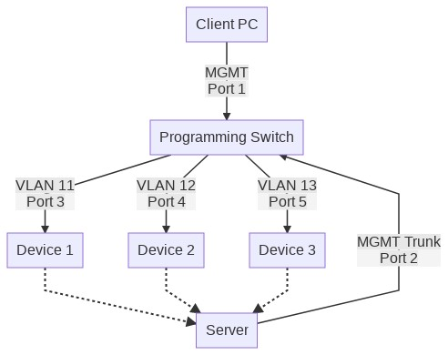

# BulkFactory

This was originally built for a previous employer on personal time on my personal system, but I believe that this work may benefit small to medium sized WISPs or small businesses.

Project designed to allow a single system to access dozens of Factory `192.168.1.20` addresses simultaneously by leveraging NGINX's TCP Reverse Proxy. This can greatly increase the speed at which a single person can program or upgrade firmware of devices.

## Hardware Requirements

1. Laptop/Desktop to perform configuration of hardware.
1. Managed Switch, (ideally 8-24 ethernet ports).
1. Dedicated private subnet
    - This project defaults to `10.0.0.0/24`.
1. A dedicated Linux server with the following hardware/software requirements:
    - 275MB RAM for each physical switch port;
        - 8 ports ~= 2.2GB RAM
        - 12 ports ~= 3.3GB RAM
    - 8GB+ Storage
    - [Docker](https://docs.docker.com/engine/install/)
    - [NGINX](https://nginx.org/en/), which has been compiled with the `--with-stream` option
    - [Unbound DNS](https://nlnetlabs.nl/projects/unbound/about/)
    - [DHCPD](https://wiki.debian.org/DHCP_Server) (Optional, but highly recommended)

> I recommend that you use [Ubuntu](https://ubuntu.com/) or [Manjaro](https://manjaro.org/) for the dedicated Linux server for simplicity sake.

### Notes

- If you don't want to have the same host act as DHCP/DNS/ReverseProxy for Bulk Factory, you can optionally replace Unbound and DHCPD above with a pfSense server. While that is my preference, most people won't have hardware simply lying around.

- Raspberry Pi's are not recommended, unless you're running a Pi4 8GB and connecting to <12 programmable devices. I cannot guarantee that everything will run as expected at this time, and there will need to be a different docker base image in ReverseProxy.

## General Network Flow



## Managed Switch Setup & Operation

All documentation will assume an 8-port managed switch, which can be used to program 6 devices at a time.

Connect your system to port 1 on the managed switch and configure the following general port settings:

- Port 1: Untag VLAN 1
- Port 2: Untag VLAN 1, Tagged VLAN 3-8
- Port 3: Untag VLAN 3
- Port 4: Untag VLAN 4
- Port 5: Untag VLAN 5
- Port 6: Untag VLAN 6
- Port 7: Untag VLAN 7
- Port 8: Untag VLAN 8

Connect your Linux Server to Port 2

## Linux Server Setup and Operation

0. Copy the [reverseProxy](reverseProxy/) directory and [`launcher.sh`](launcher.sh) to the Linux server.

1. Install NGINX, Docker, Unbound DNS, and DHCPD.
    > sudo apt install nginx docker.io unbound isc-dhcp-server

2. Replace the `nginx.conf` file at `/etc/nginx/nginx.conf` with the one in this repo.

3. Add the file [`/etc/unbound/unbound.conf.d/programming.conf`](etc/unbound/unbound.conf.d/programming.conf) to the same location on the Linux server.

4. Run `sudo systemctl stop systemd-resolvd && sudo systemctl disable systemd-resolvd`

5. Update the [`/etc/resolv.conf`](etc/resolv.conf) file with the file in the repo:

6. Restart Unbound (`sudo systemctl restart unbound`) and run `dig port03.config.net @127.0.0.1` to verify functionality. The response should look like this:

```bash
ubuntu@TestServer:$ dig port03.config.net @127.0.0.1
; <<>> DiG 9.11.3-1ubuntu1.12-Ubuntu <<>> port03.config.net @127.0.0.1
;; global options: +cmd
;; Got answer:
;; ->>HEADER<<- opcode: QUERY, status: NOERROR, id: 19178
;; flags: qr aa rd ra; QUERY: 1, ANSWER: 1, AUTHORITY: 0, ADDITIONAL: 1

;; OPT PSEUDOSECTION:
; EDNS: version: 0, flags:; udp: 4096
;; QUESTION SECTION:
;port03.config.net.             IN      A

;; ANSWER SECTION:
port03.config.net.      3600    IN      A       10.0.0.203

;; Query time: 0 msec
;; SERVER: 127.0.0.1#53(127.0.0.1)
;; WHEN: Sun Jun 28 18:05:23 UTC 2020
;; MSG SIZE  rcvd: 62
```

7. Once the above steps have been completed, it's time to run `launcher.sh`.
    > sudo ./launcher eth0

Once all of the above steps have been completed, your system (Laptop/Desktop) should pull a DHCP address, likely 10.0.0.10/24. At this point, make sure that you have a factory reset device plugged into port 3 on your switch. Once connected, you should soon be able to navigate to either [port03.config.net](https://port03.config.net) or [port03](https://port03) to hit the login page of the factory reset device. You will be able to similarly access [port04.config.net](https://port04.config.net), or other 

# General Project Notes

- If you want to change from 8 ports to 16/24/48, you'll currently need to update the proper line in [`launcher.sh`](launcher.sh). This will eventually be a simple argument when running it.
