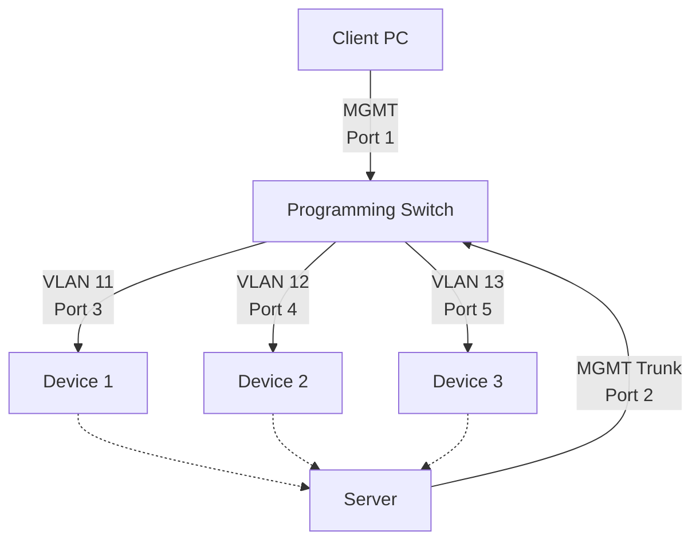

# Mermaid.js Diagram

```mermaid
graph TD;
  A[Client PC];
  P[Programming Switch];
  S[Server];
  D1[Device 1];
  D2[Device 2];
  D3[Device 3];

  A-- MGMT<br>Port 1 -->P;
  S-- MGMT Trunk<br>Port 2 -->P;
  P--VLAN 11<br>Port 3-->D1-.->S;
  P--VLAN 12<br>Port 4-->D2-.->S;;
  P--VLAN 13<br>Port 5-->D3-.->S;;
```
